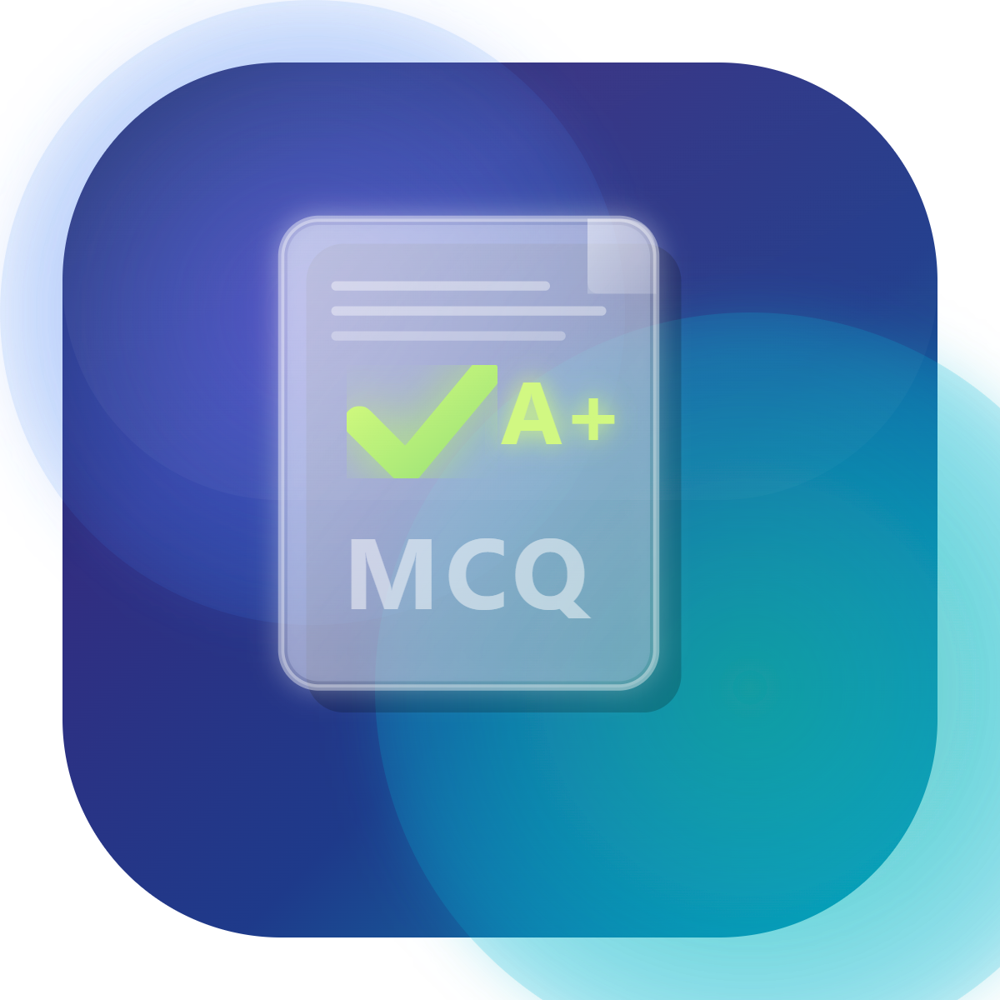

# MCQ Grader Pro



## Overview

**MCQ Grader Pro** is a comprehensive, production-grade automated grading system designed to streamline the evaluation of Multiple Choice Question (MCQ) answer sheets. By leveraging advanced Optical Mark Recognition (OMR) techniques and a modern mobile interface, it provides educators with a powerful tool for rapid and accurate grading.

## ✨ Key Features

- 🎯 **High-Accuracy OMR**: Advanced image processing using OpenCV to detect marked answers with precision, even on slightly rotated or imperfect scans.
- 📱 **Modern Flutter Interface**: A clean, intuitive mobile app for managing students, exams, and grading results.
- 📊 **Detailed Analytics**: Automatic calculation of scores, percentages, and grades (A+ to F).
- 📂 **Flexible Data Export**: Export grading results and statistics to professionally formatted Excel workbooks.
- 🗄️ **Robust Backend**: A dedicated Flask-based backend with SQLite for secure and efficient data management.
- 🌓 **Premium Design**: Modern aesthetic featuring dark/light mode support, smooth animations, and a user-centric layout.

## 🛠️ Tech Stack

### Frontend
- **Framework**: [Flutter](https://flutter.dev/)
- **State Management**: Provider/Riverpod style architecture
- **UI Components**: Material 3

### Backend
- **Core**: Python 3.x
- **Web Framework**: [Flask](https://flask.palletsprojects.com/)
- **Image Processing**: [OpenCV](https://opencv.org/), NumPy
- **OCR/OSD**: [Tesseract OCR](https://github.com/tesseract-ocr/tesseract) (via pytesseract)
- **Database**: SQLite3
- **Data Analysis**: Pandas, Openpyxl

## 🚀 Getting Started

### Prerequisites
- Flutter SDK
- Python 3.8+
- Tesseract OCR (installed on your system)

### Backend Setup
1. Navigate to the `backend` directory:
   ```bash
   cd backend
   ```
2. Create a virtual environment and activate it:
   ```bash
   python -m venv venv
   source venv/bin/activate  # On Windows: venv\Scripts\activate
   ```
3. Install dependencies:
   ```bash
   pip install -r requirements.txt
   ```
4. Run the backend server:
   ```bash
   python main.py
   ```

### Frontend Setup
1. Navigate to the project root:
   ```bash
   cd ..
   ```
2. Install Flutter dependencies:
   ```bash
   flutter pub get
   ```
3. Run the application:
   ```bash
   flutter run
   ```

## 📂 Project Structure

- `lib/`: Flutter frontend source code.
  - `src/screens/`: App screens (Home, Grading, Results, etc.).
  - `src/services/`: API and database service layers.
- `backend/`: Flask backend implementation.
  - `main.py`: Main API server and database management.
  - `requirements.txt`: Python dependencies.
- `assets/`: Image assets and logos.


---

*Developed with focus on efficiency and accuracy for modern education.*